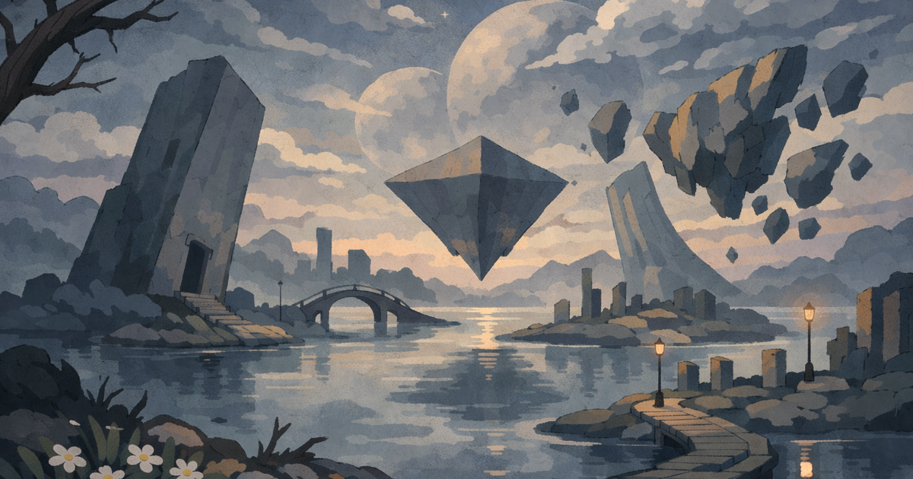

# Still Orbit

A quiet, surreal color theme with mineral blues, misty neutrals, and soft amber highlights.

## Index

- [Preview](#preview)
- [Overview](#overview)
- [Variants](#variants)
- [Documentation](#documentation)
- [Files](#files)
- [License](#license)

## Preview

| Type | Preview |
| --- | --- |
| Wallpaper |  |
| Live site |  |

## Overview

Still Orbit is a standalone theme for interfaces that want a calm, reflective visual language instead of neon contrast or overt fantasy.

It is built around foggy neutrals, mineral blues, soft amber light, and a low-noise sense of depth. The theme is designed to stay restrained in most of the interface, with color reserved for hierarchy, interaction, and quiet emphasis.

## Variants

- **Still Orbit Mist** — Light, paper-like, soft, editorial.
- **Still Orbit Night** — Dark, reflective, cinematic, architectural.

## Documentation

For setup, implementation notes, see:

- [`themes/instructions.md`](themes/README.md)

## Files

- [`themes/still-orbit.css`](themes/still-orbit.css) — standalone CSS custom properties with semantic tokens and full family scales
- [`themes/still-orbit.json`](themes/still-orbit.json) — machine-readable theme tokens and metadata
- [`themes/still-orbit-tailwind.css`](themes/still-orbit-tailwind.css) — Tailwind v4-ready `@theme` tokens
- [`themes/instructions.md`](themes/instructions.md) — usage notes, integration guidance, and theme file reference
- [`docs/palette.md`](docs/palette.md) — palette reference and semantic overview

## License

[MIT](LICENSE)
